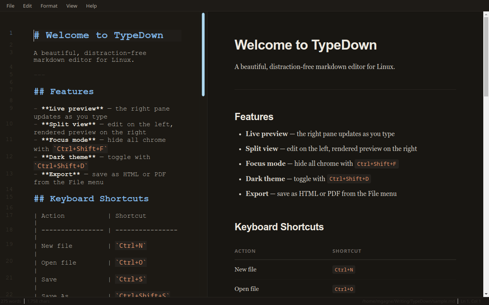

# TypeDown

A beautiful, distraction-free markdown editor for Linux.

Split-pane live preview, warm light and dark themes, clean typography, and a full set of writing shortcuts — no Electron, no cloud, no fuss.



## Features

- **Live preview** — rendered preview updates as you type (150 ms debounce)
- **Split view** — editor left, preview right; drag the divider to taste
- **Dark theme** — warm near-black palette, toggle with `Ctrl+Shift+D`
- **Focus mode** — hides chrome and preview, just you and the text (`Ctrl+Shift+F`)
- **Export** — HTML or PDF from the File menu
- **Smart editing** — list continuation on Enter, auto-pair brackets, Tab indent/unindent
- **Syntax highlighting** — headings, bold/italic, code, links, blockquotes coloured in the editor
- **Recent files**, find, line numbers, fullscreen

## Requirements

```
python3-pyqt6
python3-pyqt6.qtwebengine
python3-pyqt6.qtwebchannel
python3-markdown   (or via pip: markdown)
python3-pygments   (or via pip: Pygments)
```

Install system packages:

```bash
sudo apt install python3-pyqt6 python3-pyqt6.qtwebengine python3-pyqt6.qtwebchannel
pip install markdown pygments
```

## Running

```bash
python3 typedown.py              # blank document
python3 typedown.py notes.md     # open a file
./typedown notes.md              # via the shell launcher
```

## Keyboard shortcuts

| Action | Shortcut |
|---|---|
| New | `Ctrl+N` |
| Open | `Ctrl+O` |
| Save | `Ctrl+S` |
| Save As | `Ctrl+Shift+S` |
| Export HTML | `Ctrl+E` |
| Export PDF | `Ctrl+Shift+E` |
| Bold | `Ctrl+B` |
| Italic | `Ctrl+I` |
| Inline code | `Ctrl+`` ` `` |
| Link | `Ctrl+K` |
| Heading 1–6 | `Ctrl+1` – `Ctrl+6` |
| Toggle preview | `Ctrl+Shift+P` |
| Focus mode | `Ctrl+Shift+F` |
| Dark theme | `Ctrl+Shift+D` |
| Fullscreen | `F11` |
| Find | `Ctrl+F` |

## Project layout

```
typedown.py          entry point
typedown             shell launcher
src/
  main_window.py     window, menus, file ops, themes
  editor.py          markdown editor widget + line numbers
  highlighter.py     syntax highlighter
  preview.py         live HTML preview (WebEngine)
```
